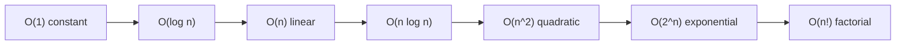

import CompareMatrix from '../../../components/CompareMatrix';
import TradeoffSlider from '../../../components/TradeoffSlider';

## Overview

Complexity analysis is the vocabulary for *how an algorithm's cost scales* as the
input grows. It lets you compare two approaches without running them, predict
which one survives a `100x` traffic increase, and spot the `O(n^2)` loop that will
become an incident at scale. The single most useful sentence in this whole cluster
is: **Big-O tells you how cost grows, not how fast the code is today.** Both
matter, and conflating them is the most common analysis mistake practitioners make.

The goal here is operational, not theoretical: enough rigor to reason correctly
about scaling, plus the practical caveats — constant factors and cache behavior —
that determine which algorithm actually wins on real hardware at realistic sizes.

## Mental model

Picture **how the cost curve bends as `n` grows toward infinity**. Complexity
analysis throws away everything that does not change the *shape* of that curve:
constant multipliers and lower-order terms. `3n + 50` and `n` are both `O(n)` —
the same straight-line shape — because once `n` is large enough the `3` and the
`50` stop mattering to the *bend*.

The three Greek letters describe three bounds on that curve:

- **Big-O (`O`)** is an **upper bound**: the algorithm grows *no faster than* this.
  "`O(n^2)`" means it will not be worse than quadratic. This is what people
  almost always mean.
- **Big-Omega (`Omega`)** is a **lower bound**: it grows *at least* this fast.
- **Big-Theta (`Theta`)** is a **tight bound**: the upper and lower bounds match,
  so it grows *exactly* this fast. When people say "`O(n)`" but mean "tightly
  `n`," they really mean `Theta(n)`.

The catch the curve hides: two `O(n)` algorithms can differ by `100x` in wall-clock
time because of constant factors and memory access patterns. The shape is the same;
the speed is not.

## Types / Variants

**Time versus space complexity.** Time counts operations; space counts extra
memory beyond the input. They trade off constantly — a hash table buys `O(1)`
lookups by spending `O(n)` memory; a precomputed table buys speed with storage.
Always state which you mean.

**Best, average, and worst case.** The same algorithm has three cost profiles.
Quicksort is `O(n log n)` on average but `O(n^2)` worst case (already-sorted input
with a naive pivot). Hash table lookup is `O(1)` average but `O(n)` worst case
(everything collides into one bucket). For latency-sensitive and adversarial
systems (anything user-facing or security-relevant), **the worst case is the one
that pages you** — an attacker can deliberately trigger it (algorithmic-complexity
DoS).

**Amortized analysis.** The *average cost per operation over a sequence*, even when
individual operations spike. A dynamic array's `append` is `O(1)` amortized: most
appends are `O(1)`, but occasionally it doubles capacity and copies everything in
`O(n)`. Spread across all appends, the average is constant. Amortized is the honest
number for throughput; the occasional spike still matters for tail latency.

**Common growth classes**, from cheapest to most expensive:

- `O(1)` constant — hash lookup, array index. Does not grow with `n`.
- `O(log n)` logarithmic — binary search, balanced-tree operations. Doubling `n`
  adds one step. Effectively flat in practice.
- `O(n)` linear — a single scan. Cost tracks input size.
- `O(n log n)` linearithmic — good comparison sorts, divide-and-conquer. The
  practical ceiling for "feels fast on large data."
- `O(n^2)` quadratic — nested loops over the same data. The classic scaling trap;
  fine to `~10^4`, painful beyond.
- `O(2^n)` exponential and `O(n!)` factorial — brute-force subset/permutation
  search. Only viable for tiny `n`; needs pruning or a smarter paradigm.

## When to use / When NOT

- **Use Big-O reasoning when:** comparing approaches before building, sizing a
  system for growth, or sanity-checking that a hot-path loop is not secretly
  `O(n^2)`. It is the right tool for "will this survive `10x`?"
- **Use worst-case analysis when:** the input is adversarial or latency SLOs are
  strict — anything user-facing, security-relevant, or tail-sensitive. Average
  case is a comfortable lie under attack.
- **Use amortized analysis when:** reasoning about throughput of structures with
  occasional rebuild spikes (dynamic arrays, hash table resizes, log-structured
  stores). It is the honest steady-state cost.
- **Do NOT rely on Big-O alone when:** `n` is small or bounded. Below the crossover
  point, constants and cache behavior dominate, and the "worse" complexity class
  often wins. Insertion sort beats quicksort for `n < ~16` — which is exactly why
  real sort implementations switch to it for small partitions.
- **Do NOT optimize a complexity class you have not measured.** Profile first; the
  bottleneck is frequently allocation, I/O, or a cache miss, not the asymptotic
  class.

## Tradeoffs

The recurring tension is **asymptotic class versus constant factors and locality**.
A lower Big-O always wins *eventually*, but "eventually" can be past any `n` you
will ever see.

| Concern | What it captures | What it ignores |
| ------ | ---- | ---- |
| Big-O class | Scaling shape as `n` grows | Constants, cache, real `n` |
| Constant factors | Per-operation cost on real hardware | How it scales |
| Cache locality | Whether memory access is sequential | Operation count |
| Space complexity | Memory growth | Time |

Two concrete reasons constants and cache dominate at realistic sizes:

- **Cache hierarchy.** A sequential array scan (`O(n)`, cache-friendly) routinely
  beats pointer-chasing through a linked list (`O(n)`, cache-hostile) by `10x`
  because contiguous memory prefetches and a random-access list does not. Same
  Big-O, wildly different speed.
- **Constant factors.** An `O(n log n)` algorithm with a fat constant can lose to
  an `O(n^2)` one with a tiny constant until `n` is large. This crossover is why
  hybrid algorithms (introsort, Timsort) exist: cheap algorithm for small inputs,
  asymptotically better one for large.

## Diagram

The further right, the faster the cost curve bends upward — and the smaller the
`n` at which the algorithm stops being usable.

## Try it

Compare how each growth class explodes as `n` rises from 10 to 1,000,000, then
slide along the "small vs huge input" axis to see when Big-O actually starts to
matter.

<CompareMatrix
  client:visible
  caption="Operation counts by growth class (approximate)"
  columns={['n = 10', 'n = 1,000', 'n = 1,000,000']}
  rows={[
    { criterion: 'O(1) constant', cells: ['1', '1', '1'] },
    { criterion: 'O(log n)', cells: ['~3', '~10', '~20'] },
    { criterion: 'O(n) linear', cells: ['10', '1,000', '1,000,000'] },
    { criterion: 'O(n log n)', cells: ['~33', '~10,000', '~20,000,000'] },
    { criterion: 'O(n^2) quadratic', cells: ['100', '1,000,000', '10^12 (intractable)'] },
    { criterion: 'O(2^n) exponential', cells: ['1,024', '10^301 (impossible)', 'impossible'] },
  ]}
/>

<TradeoffSlider
  client:visible
  caption="When does Big-O start to matter?"
  leftAxis="Small / bounded n"
  rightAxis="Huge / growing n"
  stops={[
    { label: 'Tiny n (< ~16)', description: 'Constants and cache dominate completely. The "worse" complexity class often wins. Insertion sort beats quicksort here — which is why real sorts switch to it for small partitions. Pick the simplest, most cache-friendly code.' },
    { label: 'Small n (hundreds)', description: 'Still below most crossover points. A clear O(n^2) loop is fine and readable. Optimize only if profiling proves this is the hot path.' },
    { label: 'Medium n (thousands)', description: 'O(n^2) starts to hurt (millions of operations). The crossover where asymptotically better algorithms begin to pull ahead of their constant-factor cost.' },
    { label: 'Large n (millions)', description: 'Big-O class now dominates. O(n^2) is a non-starter; O(n log n) is the practical ceiling. Constant factors still matter for choosing among same-class algorithms.' },
    { label: 'Huge / unbounded n', description: 'Only O(n log n) or better is viable on a single machine; beyond that you need O(n) streaming, approximation, or distribution across machines. Exponential classes require pruning or a smarter paradigm.' },
  ]}
/>

## Real-world examples

- **Hash-flooding DoS** exploits worst-case `O(n)` hash collisions: attackers craft
  keys that all collide, turning `O(1)` map operations into `O(n)`. Real fix in
  practice: randomized hash seeds (adopted across Python, Ruby, and many web
  frameworks after the 2011 disclosures).
- **Quicksort's `O(n^2)` worst case** on sorted input led production sort routines
  (C++ `std::sort`'s introsort, Java's dual-pivot) to detect bad pivots and fall
  back to heapsort, guaranteeing `O(n log n)`.
- **Dynamic array doubling** (Go slices, C++ `vector`, Java `ArrayList`) relies on
  amortized `O(1)` append — the occasional `O(n)` resize is amortized away. Pick
  the growth factor wrong and you waste memory or thrash.
- **Database query planners** estimate complexity (rows scanned) to choose between
  an `O(n)` table scan and an `O(log n)` index seek — Big-O reasoning automated and
  fed real cardinality statistics.

## Further reading

- [Big-O Cheat Sheet](https://www.bigocheatsheet.com/) — the canonical complexity-by-structure-and-operation reference.
- [Latency Numbers Every Programmer Should Know](https://gist.github.com/jboner/2841832) — why constant factors and the cache hierarchy dominate real performance.
- [CLRS — Introduction to Algorithms, Ch. 3 (Growth of Functions)](https://mitpress.mit.edu/9780262046305/introduction-to-algorithms/) — the rigorous treatment of asymptotic notation.
