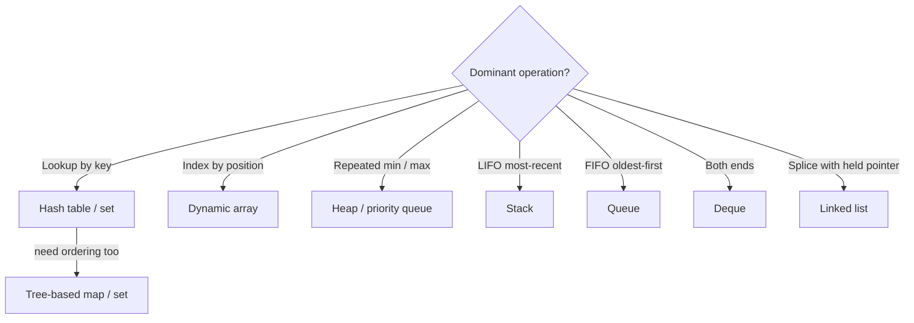

import CompareMatrix from '../../../components/CompareMatrix';
import DecisionTree from '../../../components/DecisionTree';

## Overview

The core data structures are the workhorses you reach for daily: arrays, linked
lists, stacks, queues, deques, hash tables, heaps, and sets. Each one makes a
specific set of operations cheap by making others expensive, and the whole skill
is **matching the structure's cheap operations to your hot-path access pattern**.
Get this right and the code is fast and obvious; get it wrong and you have an
`O(n)` operation buried in a loop that should have been `O(1)`.

This page is a decision reference: what each structure costs per operation, what
it is secretly good and bad at, and the one-line rule for when to reach for it.

## Mental model

Think of each structure as answering one question cheaply:

- **Array / dynamic array** — "give me the `i`-th element" (index access).
- **Linked list** — "splice something in or out *given a pointer to it*"
  (pointer-local insert/delete), at the cost of no random access.
- **Stack** — "give me the most recent thing" (LIFO).
- **Queue** — "give me the oldest thing" (FIFO).
- **Deque** — "add or remove at *either* end" cheaply.
- **Hash table** — "is this key here, and what's its value?" (`O(1)` lookup by key).
- **Heap / priority queue** — "give me the smallest (or largest) thing" repeatedly.
- **Set** — "have I seen this before?" (membership), no values.

When you can name your dominant operation in one of those sentences, you have
named your structure. Everything else is constant factors and language ergonomics.

## Types / Variants

**Arrays and dynamic arrays.** A contiguous block of memory. Index access and
in-order iteration are `O(1)` and `O(n)` *and extremely cache-friendly* —
sequential memory prefetches beautifully, which is why arrays beat "better"
structures in practice far more often than their Big-O suggests. Insert/delete in
the *middle* is `O(n)` (everything shifts). A **dynamic array** (Go slice, C++
`vector`, Python `list`, Java `ArrayList`) grows by doubling, giving amortized
`O(1)` append. **Default to this** unless you have a reason not to.

**Linked lists.** Nodes connected by pointers (singly or doubly linked).
Insert/delete is `O(1)` *only if you already hold a pointer to the node*; finding
that node is `O(n)`. No random access — getting the `i`-th element is `O(n)`. The
real cost is **cache hostility**: pointer-chasing scatters across memory and stalls
the CPU, so a list often loses to an array even where Big-O says it should win.
Use it when you need stable `O(1)` splicing with held pointers (LRU cache
internals, intrusive lists in kernels) — rarely otherwise.

**Stacks (LIFO).** Push and pop from one end, both `O(1)`. Backed by a dynamic
array in practice. Natural for recursion/call stacks, undo, expression evaluation,
DFS, and backtracking.

**Queues (FIFO).** Enqueue at the back, dequeue at the front, both `O(1)` when
backed by a ring buffer or a linked list. Natural for BFS, task/work queues,
producer-consumer pipelines, and request buffering.

**Deques (double-ended queues).** Insert/remove at *both* ends in `O(1)`. A
superset of stack and queue. Backed by a growable ring buffer. Used for sliding-window
algorithms (the monotonic deque), work-stealing schedulers, and anywhere you push
and pop from both ends.

**Hash tables.** Map keys to values via a hash function. Average `O(1)` insert,
lookup, and delete — the backbone of dictionaries, caches, indexes, and dedup.
The two knobs that govern behavior:

- **Collisions.** Two keys hash to the same bucket. Resolved by **chaining**
  (each bucket is a small list) or **open addressing** (probe for the next free
  slot). Worst case degrades to `O(n)` if everything collides — an attack vector
  (hash flooding), mitigated by randomized seeds.
- **Load factor.** Entries divided by buckets. Past a threshold (often `~0.7`) the
  table **resizes** and rehashes everything — an `O(n)` spike amortized into the
  `O(1)` average. Keeps probe chains short.

No inherent ordering; iteration order is unspecified (or insertion order in some
languages, by design, not by guarantee you should lean on).

**Heaps / priority queues.** A binary heap is a complete tree kept in an array
where each parent beats its children. Gives `O(1)` peek-min/max, `O(log n)` insert
and extract, `O(n)` build-from-array. The structure for "**repeatedly take the
smallest/largest**": schedulers, Dijkstra, top-`k`, timeouts, merge of sorted
streams. It does *not* support fast arbitrary lookup or full sorted iteration.

**Sets.** A collection of unique elements with `O(1)` average membership test
(hash set) or `O(log n)` ordered membership plus range queries (tree set). Use for
dedup, "have I seen this?", and fast intersection/union. A hash set is a hash
table without values.

## When to use / When NOT

- **Array / dynamic array — use when:** you index by position, iterate in order,
  or append; you want the cache-friendly default. **Avoid when:** you frequently
  insert/delete in the middle of a large collection (`O(n)` shifts).
- **Linked list — use when:** you need `O(1)` splicing and already hold node
  pointers (intrusive lists, LRU). **Avoid when:** you need random access or you
  iterate hot — the cache misses usually make an array faster anyway.
- **Stack — use when:** the access is genuinely LIFO (undo, DFS, parsing).
  **Avoid when:** you need FIFO or random access.
- **Queue — use when:** the access is FIFO (BFS, work queues, buffering). **Avoid
  when:** you need priorities (use a heap) or random access.
- **Deque — use when:** you push/pop at both ends (sliding window, work stealing).
  **Avoid when:** a plain stack or queue suffices — the extra generality is
  needless.
- **Hash table — use when:** the dominant operation is lookup/insert/delete by key
  and you do not need order. **Avoid when:** you need sorted iteration, range
  queries, or worst-case `O(1)` guarantees under adversarial keys (use a tree).
- **Heap — use when:** you repeatedly need the min/max or a streaming top-`k`.
  **Avoid when:** you need full sorted order at once (just sort) or arbitrary
  lookup.
- **Set — use when:** you only care about presence/uniqueness. **Avoid when:** you
  need to associate values (use a map) — though that is a near-free upgrade.

## Tradeoffs

The unifying tradeoff: **random access versus cheap insertion versus ordering
versus memory overhead**. No structure wins all four; pick the two your hot path
needs.

| Structure | Strong at | Weak at | Memory note |
| ------ | ---- | ---- | ---- |
| Dynamic array | Index, iterate, append; cache locality | Mid insert/delete (`O(n)`) | Compact, contiguous |
| Linked list | `O(1)` splice with pointer | Random access; cache misses | Pointer per node |
| Stack / queue | `O(1)` end operations | No random access | Compact (array-backed) |
| Deque | `O(1)` at both ends | No fast mid access | Slightly more than array |
| Hash table | `O(1)` lookup by key | No order; resize spikes; worst-case `O(n)` | Extra for buckets/load factor |
| Heap | `O(1)` peek, `O(log n)` push/pop | No lookup or full sort | Compact (array-backed) |
| Set | `O(1)` membership / dedup | No values; no order (hash variant) | Like a hash table |

## Diagram

## Try it

Compare the structures across the operations that actually decide your choice,
then walk the decision tree from your dominant access pattern.

<CompareMatrix
  client:visible
  caption="Average-case operation complexity by structure"
  columns={['Index / access', 'Search', 'Insert', 'Delete', 'Ordered?']}
  rows={[
    { criterion: 'Dynamic array', cells: ['O(1)', 'O(n)', 'O(1) end / O(n) mid', 'O(1) end / O(n) mid', 'Insertion order'] },
    { criterion: 'Linked list', cells: ['O(n)', 'O(n)', 'O(1) with pointer', 'O(1) with pointer', 'Insertion order'] },
    { criterion: 'Stack', cells: ['top only', 'O(n)', 'O(1) push', 'O(1) pop', 'LIFO'] },
    { criterion: 'Queue', cells: ['ends only', 'O(n)', 'O(1) enqueue', 'O(1) dequeue', 'FIFO'] },
    { criterion: 'Deque', cells: ['ends only', 'O(n)', 'O(1) either end', 'O(1) either end', 'Both ends'] },
    { criterion: 'Hash table / set', cells: ['n/a', 'O(1)', 'O(1)', 'O(1)', 'No'] },
    { criterion: 'Binary heap', cells: ['peek O(1)', 'O(n)', 'O(log n)', 'O(log n) min/max', 'Partial (heap order)'] },
  ]}
/>

<DecisionTree
  client:visible
  caption="Which core data structure?"
  root={{
    question: 'Is your dominant operation a lookup by key (or a membership test)?',
    branches: [
      {
        label: 'Yes — lookup / membership by key',
        next: {
          question: 'Do you also need sorted order or range queries?',
          branches: [
            { label: 'No, just fast lookup', next: { leaf: { recommendation: 'Hash table (or hash set if no values)', detail: 'Average O(1) insert/lookup/delete. The default for dictionaries, caches, dedup. Accept unspecified order and occasional resize spikes.' } } },
            { label: 'Yes, ordering / ranges matter', next: { leaf: { recommendation: 'Tree-based map / set (see Trees & Graphs)', detail: 'O(log n) operations with sorted iteration and range queries. Trade some lookup speed for order.' } } },
          ],
        },
      },
      {
        label: 'No — access is positional or order-based',
        next: {
          question: 'What is the access pattern?',
          branches: [
            { label: 'Index by position / iterate / append', next: { leaf: { recommendation: 'Dynamic array', detail: 'The cache-friendly default. O(1) index and amortized O(1) append. Avoid only if you do many mid-collection inserts.' } } },
            { label: 'Repeatedly take the min or max', next: { leaf: { recommendation: 'Heap / priority queue', detail: 'O(1) peek, O(log n) push/pop. Schedulers, top-k, Dijkstra, timeouts.' } } },
            { label: 'LIFO (most recent first)', next: { leaf: { recommendation: 'Stack', detail: 'O(1) push/pop. Undo, DFS, parsing, backtracking.' } } },
            { label: 'FIFO (oldest first)', next: { leaf: { recommendation: 'Queue', detail: 'O(1) enqueue/dequeue. BFS, work queues, buffering.' } } },
            { label: 'Add/remove at both ends', next: { leaf: { recommendation: 'Deque', detail: 'O(1) at both ends. Sliding windows, work stealing.' } } },
          ],
        },
      },
    ],
  }}
/>

## Real-world examples

- **LRU caches** combine a hash table (for `O(1)` lookup) with a doubly-linked list
  (for `O(1)` recency reordering) — the textbook case where a linked list earns its
  keep, because you always hold the node pointer.
- **Redis** is essentially a toolbox of these structures exposed as a service:
  hashes, lists, sorted sets (skip-list + hash), and sets, each chosen by the
  client's access pattern.
- **OS schedulers and timer wheels** use heaps (or specialized variants) to always
  dispatch the next-due task in `O(log n)`.
- **Compilers and interpreters** use stacks for call frames and expression
  evaluation, and hash tables for symbol tables.

## Further reading

- [Big-O Cheat Sheet — common data structure operations](https://www.bigocheatsheet.com/) — the per-operation complexity table at a glance.
- [Open Data Structures (Pat Morin) — arrays, lists, hash tables, heaps](https://opendatastructures.org/) — free, implementation-level treatment of every structure here.
- ["Why you should never use linked lists" discussions / cache-effects benchmarks](https://www.youtube.com/watch?v=YQs6IC-vgmo) — Bjarne Stroustrup on why arrays beat lists in practice despite Big-O.
