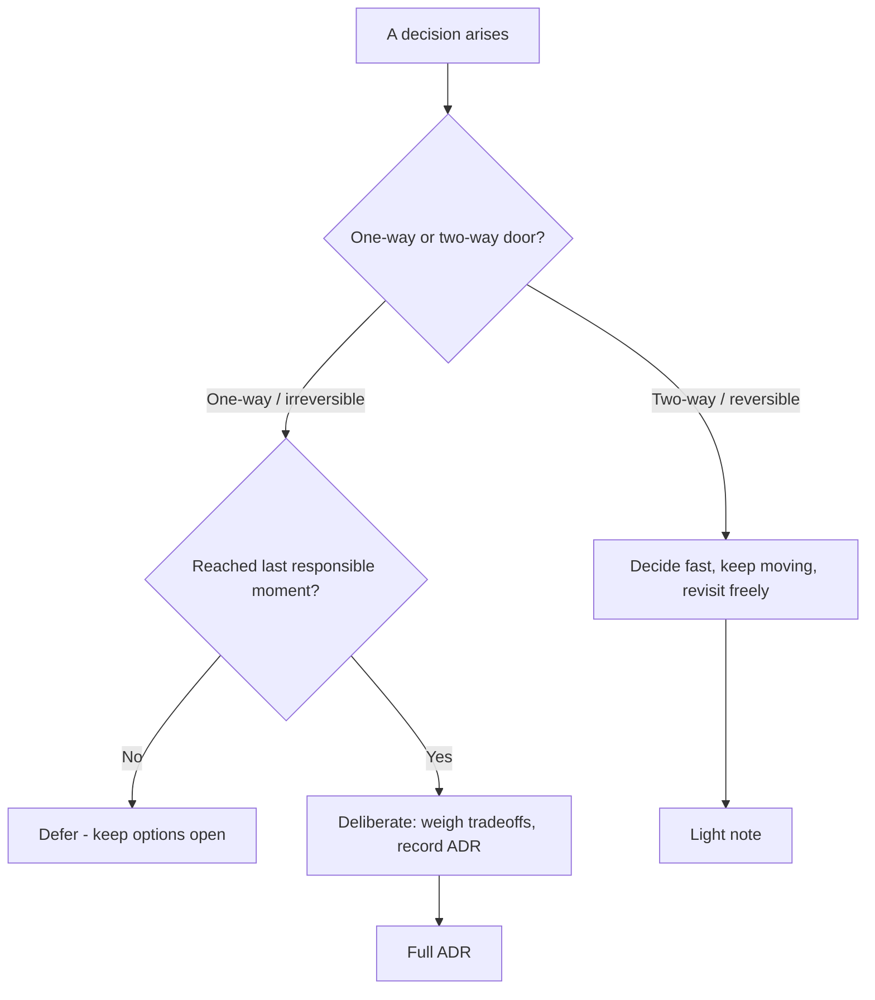

import Mermaid from '../../../components/Mermaid.astro';
import DecisionTree from '../../../components/DecisionTree';
import WhenWhyTabs from '../../../components/WhenWhyTabs';

## Overview

Architecture *is* a stream of decisions, so the most durable architectural skill
is not knowing patterns — it is **making and recording decisions well**. A good
architecture decision is one that is traced to a real driver, weighed against its
alternatives and their tradeoffs, made at the right *time* (neither prematurely
nor too late), and **written down with its rationale** so that future maintainers
understand not just what was decided but *why* — and can tell whether the reasons
still hold. Undocumented decisions rot into folklore; their original context is
lost, so nobody dares change them and nobody remembers why they exist.

This page is the decision-making discipline that ties the cluster together: how to
record decisions (**ADRs**), how to do lightweight tradeoff analysis
(**ATAM-lite**), how to keep architecture changeable over time (**evolutionary
architecture** and the **last responsible moment**), and three recurring,
high-leverage judgment calls — **build vs. buy**, **deliberate tech debt**, and
the **"boring technology" principle**. The throughline: make decisions
*deliberately and reversibly where you can*, *irreversibly only when you must*,
and *always with the reasoning preserved*.

## Mental model

Two ideas govern good decision-making.

**1. Type 1 vs Type 2 decisions (one-way vs two-way doors).** Some decisions are
**irreversible** — expensive or impossible to undo (your core data model, your
primary datastore choice, a public API contract, splitting into microservices).
These deserve heavy deliberation. Most decisions are **reversible** — cheap to
change later (a library, an internal interface, a deployment detail). Treating a
reversible decision as if it were irreversible wastes time and kills momentum;
treating an irreversible one casually is how you accrue expensive regret. The
first question for any decision: *which door is this?* Spend your deliberation
budget on the one-way doors.

**2. Decide at the last responsible moment — not the last possible one.** Defer a
decision until the moment when deferring further would *foreclose options or
significantly raise cost*. Earlier than that, you are deciding with less
information than you'll have later (premature). Later than that, you've let the
decision get made *for* you by default or by accretion (too late). The
"responsible" qualifier matters: this is not procrastination — it is keeping
options open precisely as long as keeping them open is free, then committing
decisively. Combined with door-type: keep two-way doors open longer; commit
one-way doors at *their* last responsible moment with full deliberation.

Wrapping both: every significant decision gets an **ADR** capturing context,
the options considered, the decision, and its consequences — so the reasoning
survives the people.

## Types / Variants

**Architecture Decision Records (ADRs).** A short, version-controlled document —
one per significant decision — capturing: **Context** (the forces and drivers),
**Decision** (what was chosen), **Status** (proposed/accepted/superseded),
**Consequences** (what becomes easier and harder), and the **alternatives
considered**. Kept next to the code (a `docs/adr/` directory), numbered, and
*immutable* — you supersede an ADR with a new one rather than editing history.
ADRs are the single highest-ROI documentation practice in architecture: cheap to
write, invaluable when someone six months later asks "why is it like this?"

**ATAM-lite (tradeoff analysis).** The full Architecture Tradeoff Analysis Method
is a heavyweight evaluation workshop; the *lite* version most teams actually use:
(1) list the prioritized quality attributes as concrete scenarios, (2) for each
candidate decision identify the **sensitivity points** (where the decision
strongly affects an attribute) and **tradeoff points** (where it helps one
attribute at another's expense), (3) name the **risks** the decision introduces.
The output isn't a score — it's an explicit map of *what each option costs which
attribute*, which is exactly what you record in the ADR.

**Evolutionary architecture.** Architecture designed to *change* gracefully over
time rather than be right up front, guarded by **fitness functions** (automated
checks that the system still holds its required properties — layering rules,
latency budgets, dependency-cycle bans). The premise: you cannot predict the
future, so optimize for *changeability* and make incremental, guarded change safe,
instead of betting everything on an upfront big design.

**The last responsible moment (LRM).** The decision-timing discipline above,
applied as a practice: actively identify which decisions can be deferred, keep
their options open (via abstraction seams or simply not committing), and track the
trigger that says "now is the moment." Pairs with reversible-by-default design.

**Build vs. buy.** For each capability, decide whether to build it, buy/adopt it
(SaaS, library, open-source), or use a managed service. Build the **core domain**
(your differentiator — DDD's core subdomain); **buy generic and supporting
subdomains** (auth, email, payments rails, observability). Weigh total cost of
ownership (build = ongoing maintenance + opportunity cost; buy = license +
lock-in + fit gaps), strategic control, and time-to-market. The default bias:
*don't build what isn't your competitive advantage.*

**Deliberate tech debt.** Tech debt as a *tool*, per Martin Fowler's quadrant:
debt can be **prudent or reckless**, **deliberate or inadvertent**. Prudent-and-
deliberate debt ("we'll ship the simple version now and refactor when the pattern
is clear") is a legitimate, conscious tradeoff of future cost for present speed —
*provided it's recorded and has a payback intent*. The failure mode is letting
deliberate shortcuts become permanent inadvertent debt because no one wrote down
the loan.

**Boring technology.** The principle (Dan McKinley's "Choose Boring Technology")
that every team has a limited budget of **innovation tokens**, and you should
spend them on your *core problem*, not on novel infrastructure. Boring, proven
technology (PostgreSQL, a standard message broker, a mainstream language) has
known failure modes, deep operational knowledge, and a hiring pool — its very
"boringness" is a feature. Spend your scarce novelty budget where it differentiates
you, and pick boring everywhere else.

## When to use / When NOT

- **ADRs — use for:** every *significant* (architectural, hard-to-reverse)
  decision. **Don't bother for:** trivial, easily-reversed choices — over-
  documenting reversible decisions is noise. The test is the door type.
- **ATAM-lite — use when:** an important decision has competing quality-attribute
  implications and stakeholders disagree on priorities. **Skip when:** the choice
  is obvious or low-stakes.
- **Evolutionary architecture / fitness functions — use when:** the system is
  long-lived and the future is uncertain (almost always). **Less critical for:**
  short-lived or throwaway systems.
- **LRM — use to:** defer reversible and not-yet-forced decisions. **Don't use as:**
  an excuse to never decide — find and act on the trigger.
- **Build — when:** it's your core differentiator. **Buy — when:** it's generic or
  supporting; you'd be reinventing a solved problem.
- **Deliberate debt — take when:** speed now genuinely outweighs cost later *and*
  you record it with payback intent. **Avoid when:** the debt is in a stable,
  high-churn core you'll pay interest on forever, or it would go unrecorded.
- **Boring technology — default to it.** Spend innovation tokens **only** on the
  core problem. **Choose the exciting option only when** the boring one genuinely
  cannot meet a real driver.

## Tradeoffs

| Decision lever | Lean one way when… | Lean the other when… |
| -------------- | ------------------ | -------------------- |
| Decide now vs LRM-defer | Door is one-way and the moment has come | Reversible, or more information is coming |
| Heavy ATAM vs light note | Stakes high, attributes conflict | Low-stakes or obvious |
| Build vs buy | It's your core differentiator | It's generic/supporting — buy it |
| Take debt vs do it right | Speed now > cost later, recorded | Stable core you'll pay interest on forever |
| Boring vs novel tech | Almost always — known failure modes | Only where novelty is the differentiator |
| Upfront design vs evolutionary | Irreversible foundations | Everything that can change cheaply |

The meta-tradeoff: **optionality vs. commitment.** Keeping options open has value
(real-options thinking) but also a carrying cost (abstraction, indecision). The
discipline is to pay for optionality only on the decisions where being wrong is
expensive, and to commit cheaply and quickly everywhere else.

## Diagram

The decision lifecycle: classify the door, time it to the last responsible moment,
analyze tradeoffs, record an ADR, and let fitness functions guard it as the system
evolves.

<Mermaid code={`graph LR
  ID[Significant decision identified] --> DOOR{One-way door?}
  DOOR -->|No| QUICK[Decide quickly, light record]
  DOOR -->|Yes| TIME[Wait for last responsible moment]
  TIME --> ATAM[ATAM-lite: sensitivity + tradeoff + risk]
  ATAM --> ADR[Write ADR: context, decision, consequences]
  ADR --> FF[Fitness functions enforce it]
  FF -.->|drivers changed| SUP[Supersede with new ADR]`} />

## Try it

The tree routes a pending decision; the tabs give you the three recurring
judgment calls in usable form.

<DecisionTree
  client:visible
  caption="How should I make this decision?"
  root={{
    question: 'Is this decision a one-way door — expensive or impossible to reverse later?',
    branches: [
      {
        label: 'No — reversible (two-way door)',
        next: { leaf: { recommendation: 'Decide fast, record lightly, revisit freely', detail: 'Reversible decisions deserve momentum, not deliberation. Pick a sensible default, leave a short note, and change it later if needed. Do not burn ATAM workshops on two-way doors.' } },
      },
      {
        label: 'Yes — irreversible (one-way door)',
        next: {
          question: 'Have you reached the last responsible moment — would deferring further foreclose options or raise cost?',
          branches: [
            {
              label: 'Not yet — more information is coming',
              next: { leaf: { recommendation: 'Defer; keep options open behind a seam', detail: 'Decide at the last responsible moment, not the last possible one. Hold the option open via an abstraction seam or by simply not committing, and track the trigger that says "now".' } },
            },
            {
              label: 'Yes — the moment has come',
              next: {
                question: 'Is this capability your core competitive differentiator?',
                branches: [
                  { label: 'Yes — it is the core domain', next: { leaf: { recommendation: 'Build it; ATAM-lite + full ADR; choose boring tech around it', detail: 'Invest your best effort and deliberation here. Run a lightweight tradeoff analysis, record a full ADR with alternatives and consequences, and spend innovation tokens on this core — keep everything around it boring.' } } },
                  { label: 'No — generic or supporting', next: { leaf: { recommendation: 'Buy / adopt; record the ADR; default to boring', detail: 'Do not reinvent a solved problem. Buy or adopt a proven option, weigh lock-in and TCO, record the decision, and reserve your innovation budget for the core.' } } },
                ],
              },
            },
          ],
        },
      },
    ],
  }}
/>

<WhenWhyTabs
  client:visible
  caption="The recurring judgment calls"
  tabs={[
    {
      label: 'Build vs buy',
      content:
        'Build only your core domain — the capability that differentiates you. Buy or adopt generic and supporting subdomains (auth, email, payment rails, observability): reinventing them spends effort where you have no advantage. Weigh total cost of ownership — build means ongoing maintenance plus opportunity cost; buy means license, lock-in, and fit gaps — but bias hard toward "don\'t build what isn\'t your competitive advantage."',
    },
    {
      label: 'Tech debt as a tool',
      content:
        'Debt is prudent-or-reckless and deliberate-or-inadvertent (Fowler\'s quadrant). Prudent-and-deliberate debt — shipping the simple version now and refactoring once the pattern is clear — is a legitimate trade of future cost for present speed, but only if it is recorded and carries a payback intent. The failure mode is deliberate shortcuts silently becoming permanent inadvertent debt because no one wrote down the loan. Never take debt in a stable, high-churn core you will pay interest on forever.',
    },
    {
      label: 'Boring technology',
      content:
        'You have a limited budget of innovation tokens. Spend them on the core problem that differentiates you, and choose boring, proven technology for everything else. Boring tech (PostgreSQL, a mainstream broker and language) has known failure modes, deep operational knowledge, and a hiring pool — its boringness is the feature. Reach for the novel option only when the boring one genuinely cannot satisfy a real driver.',
    },
  ]}
/>

## Real-world examples

- **ADRs** originated with Michael Nygard's 2011 post and are now mainstream
  (adr-tools, Markdown ADRs in `docs/adr/`), recommended by the ThoughtWorks Tech
  Radar and adopted across GitHub, Google, and AWS Well-Architected guidance.
- **ATAM** was developed at the SEI (Carnegie Mellon); most teams run the
  lightweight scenario/sensitivity/tradeoff/risk distillation rather than the full
  multi-day method.
- **"Choose Boring Technology"** (Dan McKinley, from Etsy's engineering culture)
  is a widely-cited counterweight to résumé-driven development; many mature
  platforms standardize on a small, boring core stack on purpose.
- **Evolutionary architecture and fitness functions** are practiced via ArchUnit,
  dependency-cruiser, and load-test gates that fail the build on architectural
  drift — turning recorded decisions into enforced invariants.

## Further reading

- [Documenting Architecture Decisions — Michael Nygard](https://cognitect.com/blog/2011/11/15/documenting-architecture-decisions) — the original ADR format and rationale.
- [Choose Boring Technology — Dan McKinley](https://mcfunley.com/choose-boring-technology) — the innovation-tokens argument for boring defaults.
- [TechnicalDebtQuadrant — Martin Fowler](https://martinfowler.com/bliki/TechnicalDebtQuadrant.html) — prudent/reckless × deliberate/inadvertent debt.
- [Architecture Tradeoff Analysis Method (ATAM) — SEI](https://www.sei.cmu.edu/library/architecture-tradeoff-analysis-method-collection/) — the full method behind the lightweight version.
