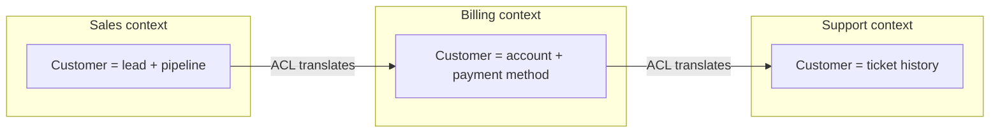

import Mermaid from '../../../components/Mermaid.astro';
import WhenWhyTabs from '../../../components/WhenWhyTabs';

## Overview

**Domain-Driven Design (DDD)** is the discipline of aligning software structure
with the structure of the *business domain* it serves. Its central architectural
payoff is an answer to the hardest question in the
[monolith-to-microservices](/architecture/monolith-microservices/) decision:
**where should the boundaries go?** DDD's answer is that boundaries should follow
the domain — specifically its **bounded contexts** — not technical layers, not
the org chart by accident, and certainly not arbitrary "noun = service"
decomposition. Get the boundaries from the domain and your services are
cohesive and loosely coupled; get them from anywhere else and you build a
distributed monolith.

DDD has two halves that are often conflated. **Strategic DDD** is about the *big
picture*: carving the domain into bounded contexts, defining a precise shared
language inside each, and mapping the relationships between them. This is the part
with direct architectural consequences and the part most worth adopting.
**Tactical DDD** is a toolkit of building blocks (entities, value objects,
aggregates, domain events) for modeling rich logic *inside* one context. The
strategic half is where service boundaries come from; the tactical half is how you
keep a single context's model clean. Most teams under-invest in the strategic half
and over-engineer the tactical half.

## Mental model

A large domain is not one model — it is *several models that use the same words to
mean different things*. The word "customer" in the sales context (a lead with a
pipeline stage) is not the "customer" in the billing context (an account with a
payment method) or the support context (a ticket history). Trying to build **one
canonical model** for the whole enterprise is the classic failure: it pleases no
one, couples everyone, and grows into an unmaintainable god-model.

DDD's core move is to stop fighting this. **Draw boundaries — bounded contexts —
inside which one model and one language are internally consistent, and let
different contexts have different models for the "same" concept.** Each bounded
context is a candidate service boundary because, by construction, the things
inside it change together and the things across the boundary are deliberately
decoupled. The **ubiquitous language** is the enforcement mechanism: inside a
context, code, conversation, and documentation all use exactly the same terms, so
the model in the code *is* the domain experts' mental model. Where contexts meet,
you translate — and the **anti-corruption layer** is the translator that stops
one context's model from leaking into and corrupting another's.

## Types / Variants

### Strategic DDD — where boundaries come from

**Bounded context.** An explicit boundary (a subsystem, a service, a module)
within which a particular domain model and its ubiquitous language apply
consistently. It is the unit of decomposition: each bounded context is a strong
candidate for a service or a module. Crucially, the boundary is *linguistic and
behavioral*, not just data — it is "where these words mean these things and these
rules hold."

**Ubiquitous language.** A rigorous, shared vocabulary for *one* bounded context,
used identically by domain experts and in the code. No translation between
"business speak" and "developer speak" inside a context — the class is called
`Loan`, not `LoanDTO2`, and "disbursement" means exactly one thing. The language
is the litmus test for a boundary: when the same word starts meaning two different
things, you have found a context boundary.

**Subdomains (core / supporting / generic).** The problem space splits into a
**core domain** (your competitive differentiator — invest your best people here,
build it custom), **supporting subdomains** (necessary but not differentiating —
build simply), and **generic subdomains** (solved problems like auth, email,
billing — *buy* or use off-the-shelf). This classification directly drives
build-vs-buy and where to spend modeling effort.

**Context mapping.** The documented relationships between bounded contexts, naming
both the integration *and* the power dynamic. Common patterns: **Partnership**
(two contexts succeed/fail together, coordinated), **Shared Kernel** (a small
shared model — use sparingly, it re-couples), **Customer/Supplier** (downstream
has a say upstream), **Conformist** (downstream just accepts the upstream model,
no leverage), **Anti-Corruption Layer** (downstream translates to protect its
model), **Open Host Service / Published Language** (upstream offers a stable,
documented API/event schema for many consumers). The map is the architecture's
integration blueprint.

### Tactical DDD — modeling inside one context

**Entity.** An object defined by *identity and continuity*, not its attributes — a
`Loan` is the same loan even as its balance changes. Has a stable ID; mutable.

**Value object.** Defined entirely by its *attributes*, has no identity, and is
immutable — `Money(amount, currency)`, `DateRange`, `EmailAddress`. Two value
objects with equal attributes are equal. Preferring value objects shrinks the
mutable, identity-bearing surface and makes logic safer.

**Aggregate.** A cluster of entities and value objects treated as a single
**consistency boundary**, accessed only through one **aggregate root**. The
aggregate enforces all its invariants atomically, and **one aggregate = one
transaction** is the rule of thumb. Aggregate boundaries are where you decide what
must be strongly consistent (inside) versus eventually consistent (across, via
events). This is the most architecturally consequential tactical pattern: it sets
your transaction granularity.

**Domain event.** A record that something *meaningful to the domain* happened —
`LoanDisbursed`, `PaymentReceived`. Domain events are how aggregates and contexts
communicate without coupling: one aggregate commits, emits an event, and other
aggregates/contexts react eventually. They are the natural seam between
strongly-consistent islands (aggregates) and the eventually-consistent sea
(everything else) — and the backbone of event-driven integration across services.

**Anti-corruption layer (ACL).** A translation layer at a context boundary
(especially against a legacy system or a third-party API) that maps the foreign
model into your context's clean model, so the foreign concepts never leak inward.
The single most valuable tactical pattern for protecting a new, clean context from
a messy upstream one.

## When to use / When NOT

- **Strategic DDD — use when:** the domain has real complexity and multiple
  stakeholders with different mental models, and you must decide service or module
  boundaries. Bounded contexts and context mapping are the highest-leverage,
  lowest-cost part of DDD and worth doing even on a monolith. **Avoid when:** the
  domain is trivial CRUD with one obvious model — there is no linguistic
  ambiguity to resolve.
- **Tactical DDD — use when:** a *core* subdomain has rich, invariant-heavy logic
  worth modeling carefully (lending rules, pricing, inventory allocation).
  Aggregates earn their keep when consistency boundaries are non-trivial.
  **Avoid when:** the subdomain is supporting/generic or thin CRUD — full
  aggregates, repositories, and domain events become ceremony that buries simple
  logic. Do not apply tactical DDD uniformly; reserve it for the core.
- **Anti-corruption layer — use when:** integrating with a legacy or third-party
  system whose model you do not want to inherit. **Avoid when:** the upstream
  model is already clean and stable enough to conform to.

## Tradeoffs

| Decision | Benefit | Cost |
| -------- | ------- | ---- |
| Multiple bounded contexts vs one canonical model | Cohesive, decoupled, each context evolves freely | Translation at boundaries; some concept "duplication" |
| Ubiquitous language | Code mirrors domain; fewer misunderstandings | Discipline; ongoing alignment with domain experts |
| Aggregates as consistency boundaries | Clear transaction scope; safe invariants | Cross-aggregate work becomes eventually consistent |
| Domain events for integration | Loose coupling, async, audit trail | Eventual consistency; event versioning |
| Anti-corruption layer | Protects your model from a messy upstream | Extra translation code to write and maintain |
| Full tactical DDD everywhere | Rich models where needed | Massive over-engineering on simple subdomains |

The defining tradeoff: DDD trades *some apparent duplication and translation
effort* for *durable decoupling and a model that matches reality*. On a complex
core domain that is a great trade; on simple CRUD it is pure overhead.

## Diagram

A context map: three bounded contexts, the integration relationships between them,
and an anti-corruption layer shielding a clean context from a legacy one.

<Mermaid code={`graph TD
  subgraph Core
    LEND[Lending context - core domain]
  end
  subgraph Supporting
    BILL[Billing context]
    NOTIF[Notifications context]
  end
  subgraph External
    LEG[Legacy core-banking system]
  end
  LEND -->|Published language: domain events| BILL
  LEND -->|Open host service: events| NOTIF
  LEG -->|Anti-corruption layer| LEND
  BILL -->|Customer/Supplier| NOTIF`} />

## Try it

The tabs separate the strategic boundary-finding work from when tactical modeling
pays off and why DDD changes your architecture.

<WhenWhyTabs
  client:visible
  caption="Strategic vs tactical DDD"
  tabs={[
    {
      label: 'When (strategic)',
      content:
        'Reach for strategic DDD whenever you must decide service or module boundaries on a non-trivial domain. Find bounded contexts by listening for where the same word means different things (customer in sales vs billing vs support). Each bounded context is a candidate service. Build a context map naming the integration and power dynamic between contexts. This is worth doing even inside a monolith — it tells you where the future seams are.',
    },
    {
      label: 'When (tactical)',
      content:
        'Apply tactical patterns only to a core subdomain with rich invariants. Model entities by identity, value objects by attributes (immutable), and cluster invariants into aggregates — one aggregate is one transaction, which sets your consistency granularity. Use domain events to communicate across aggregates and contexts. Skip all of this on supporting and generic subdomains: there, plain CRUD is correct and aggregates are ceremony.',
    },
    {
      label: 'Why it shapes architecture',
      content:
        'Service boundaries drawn from bounded contexts are cohesive (things that change together stay together) and loosely coupled (translation at the seams), which is exactly what keeps microservices from collapsing into a distributed monolith. Aggregate boundaries decide what is strongly consistent versus eventually consistent. The anti-corruption layer keeps a clean context from inheriting a messy upstream model. DDD is, in effect, the boundary-finding engine for service-level architecture.',
    },
  ]}
/>

## Real-world examples

- **Bounded contexts as service boundaries** are now the mainstream recommendation
  for microservice decomposition (Sam Newman, Chris Richardson) — "one service per
  bounded context" is the default heuristic precisely because it yields cohesive,
  decoupled services.
- **Fintech / lending** is a textbook core-domain case: the lending rules engine is
  the competitive core (full tactical DDD, aggregates enforcing regulatory
  invariants), while KYC, notifications, and billing are supporting/generic
  subdomains to buy or build simply — and an ACL shields the new platform from a
  legacy core-banking system.
- **Event Storming** (Alberto Brandolini) is the widely-used workshop technique for
  discovering bounded contexts and aggregates collaboratively with domain experts,
  by mapping domain events on a wall.
- **Axon, MassTransit, and similar frameworks** bake the tactical building blocks
  (aggregates, domain events, ACLs) into code, especially in CQRS/event-sourced
  systems where domain events are first-class.

## Further reading

- [Domain-Driven Design Reference — Eric Evans](https://www.domainlanguage.com/ddd/reference/) — the condensed pattern catalogue from the foundational book.
- [BoundedContext — Martin Fowler](https://martinfowler.com/bliki/BoundedContext.html) and [Ubiquitous Language](https://martinfowler.com/bliki/UbiquitousLanguage.html) — crisp definitions of the two central strategic ideas.
- [DDD and Microservices — Chris Richardson (microservices.io)](https://microservices.io/patterns/decomposition/decompose-by-subdomain.html) — decomposing services by subdomain / bounded context.
- [Anti-Corruption Layer — Microsoft Azure Architecture Center](https://learn.microsoft.com/en-us/azure/architecture/patterns/anti-corruption-layer) — the ACL pattern with implementation guidance.
