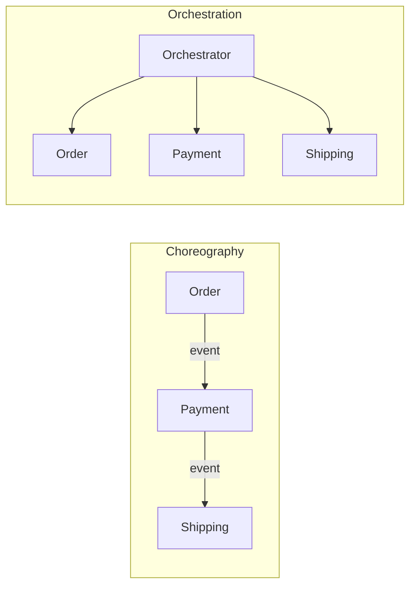

import Mermaid from '../../../components/Mermaid.astro';
import WhenWhyTabs from '../../../components/WhenWhyTabs';

## Overview

Once a system is decomposed into services, the architecture is mostly defined by
**how those services talk to each other and share data**. This is where most
distributed systems succeed or fail: the decomposition can be perfect, but if the
services call each other in long synchronous chains, share a database, or
coordinate through a smart central broker, you have rebuilt a monolith with
network latency bolted on — the **distributed monolith**. Integration is the part
of architecture where coupling either stays low (and the promised independence is
real) or quietly creeps back in.

This page covers the system-level integration decisions: synchronous versus
asynchronous communication, who coordinates a multi-service workflow
(orchestration versus choreography), how to assemble data that lives in many
services (API composition), the infrastructure that carries service-to-service
traffic (service mesh), the rule that keeps services independent
(**database-per-service**), the anti-patterns that re-couple them (shared
database, shared data access), and the pattern for getting *from* a monolith *to*
this world incrementally without a big-bang rewrite (the **strangler fig**). The
*tactical* mechanics of these — saga compensation, event schemas, broker choice —
live in the [Event-Driven Architecture](/event-driven/) cluster and the
[Architectural patterns](/design-patterns/architectural-patterns/) page; here we
make the architecture-level calls.

## Mental model

Two questions decide most of your integration architecture.

**1. Synchronous or asynchronous?** Synchronous (request/response — REST, gRPC)
is simple to reason about and gives an immediate answer, but it **temporally
couples** caller and callee: the caller blocks, and the callee's latency and
availability become the caller's. A chain of synchronous calls multiplies failure
probability and latency. Asynchronous (events/messages via a broker) **decouples
in time**: the producer doesn't wait, the consumer can be down and catch up, and
load is buffered — at the cost of eventual consistency and harder end-to-end
debugging. The architectural default for *cross-service* communication should lean
async; reserve synchronous for genuine query/response where the caller truly needs
the answer now.

**2. Who owns the workflow — a coordinator or the participants?**
**Orchestration** puts a central coordinator in charge of a multi-step workflow:
it calls each service and decides what happens next (explicit, observable,
easy to change centrally — but the orchestrator becomes a coupling point and a
single thing to operate). **Choreography** has each service react to events and
emit its own, with no central brain (maximally decoupled and resilient — but the
overall workflow is *implicit*, smeared across services, and hard to follow or
change). Neither is universally right; the rule of thumb is *choreograph simple,
stable flows; orchestrate complex flows that need visibility, central control, or
frequent change.* (Detailed in the EDA cluster.)

The unifying principle behind both, and behind the data rules below, is **own your
coupling**. Every synchronous call, every shared table, every central coordinator
is a coupling you must justify against the independence it costs.

## Types / Variants

**Synchronous communication (REST / gRPC / GraphQL).** Caller blocks for a
response. Use for queries and commands where the caller needs the result to
proceed. Keep chains shallow; deep synchronous call graphs are a latency and
availability anti-pattern. Mitigate with timeouts, retries (idempotent only),
circuit breakers, and bulkheads.

**Asynchronous communication (events / messages).** Producer emits to a broker;
consumers process independently. Decouples time and identity, buffers load,
survives consumer downtime. The backbone of resilient service integration. Costs
eventual consistency, ordering/duplication handling, and end-to-end traceability.

**Orchestration.** A central coordinator (a workflow engine or a saga
orchestrator) drives a multi-service process step by step. *Pros:* explicit,
observable, centrally changeable, easy to reason about failures and
compensations. *Cons:* the orchestrator is a coupling point and an operational
component. Best for complex or frequently-changing workflows.

**Choreography.** Services react to each other's events with no central
coordinator. *Pros:* maximal decoupling, no single bottleneck, naturally
resilient. *Cons:* the end-to-end flow is implicit and hard to trace or change;
risk of cyclic event dependencies. Best for simple, stable flows.

**API composition.** A component (often an API gateway or a Backend-for-Frontend)
gathers data from several services and assembles a single response — the read-side
counterpart to decomposition. *Pros:* clients see one API over many services.
*Cons:* the composer fans out to N services (latency, partial-failure handling);
for complex queries this pushes you toward CQRS read models instead. Related:
**API gateway** (single entry point, cross-cutting concerns) and **BFF**
(a gateway tailored per client type) — see the [APIs cluster](/apis/).

**Service mesh.** A dedicated infrastructure layer (sidecar proxies like Envoy,
managed by Istio/Linkerd) that handles service-to-service networking concerns —
mTLS, retries, timeouts, circuit breaking, load balancing, traffic shifting, and
observability — *out of the application code*. *Pros:* consistent, policy-driven
networking and security without per-service plumbing. *Cons:* significant
operational complexity and resource overhead; usually justified only at
double-digit service counts.

**Database-per-service (the rule).** Each service owns its data store; no other
service reads or writes it directly — access is only through the owning service's
API or its published events. This is *the* rule that makes services independently
deployable and independently evolvable, because the schema is private. It is the
non-negotiable core of microservices data architecture.

**Shared-data anti-patterns.** The **shared database** (multiple services reading
and writing the same tables) re-couples them at the schema level — a change for
one breaks the others, and they can no longer deploy or evolve independently. The
**integration database** and direct cross-service table reads are the same trap.
These are the most common way a microservices migration silently becomes a
distributed monolith.

**Strangler fig (migration).** Incrementally replace a monolith by routing
specific capabilities to new services one at a time, behind a façade/proxy, while
the monolith keeps serving the rest — until the new system has "strangled" the old
one and it can be removed. *Why:* avoids the catastrophic big-bang rewrite;
delivers value continuously and de-risks each step.

## When to use / When NOT

- **Synchronous — use when:** a query needs an immediate answer, or a command's
  result is required to continue. **Avoid when:** it would create a deep call
  chain or temporally couple services that should be independent — prefer async.
- **Asynchronous — use when:** the caller doesn't need to block, you want load
  buffering and resilience to downstream downtime, or you're integrating many
  services. **Avoid when:** the interaction is genuinely a synchronous query and
  eventual consistency would confuse the client.
- **Orchestration — use when:** the workflow is complex, changes often, or needs
  central visibility and explicit compensation. **Avoid when:** the flow is simple
  and stable — the orchestrator is needless coupling.
- **Choreography — use when:** the flow is simple, stable, and you prize decoupling
  and resilience. **Avoid when:** the workflow is complex — implicit flow becomes
  unmaintainable and untraceable.
- **API composition — use when:** clients need a unified view over a few services
  and the queries are simple. **Avoid when:** queries are complex or fan-out is
  large — use a CQRS read model instead.
- **Service mesh — use when:** many services and you need uniform mTLS, traffic
  policy, and observability. **Avoid when:** a handful of services — libraries or
  a gateway suffice and the mesh overhead isn't worth it.
- **Database-per-service — always, in microservices.** **Never** share a database
  across service boundaries.
- **Strangler fig — use when:** migrating a monolith you cannot afford to rewrite
  at once (almost always). **Avoid when:** the system is tiny and a clean rewrite
  is genuinely cheaper and lower-risk.

## Tradeoffs

| Choice | Buys you | Costs you |
| ------ | -------- | --------- |
| Synchronous | Simplicity, immediate result | Temporal coupling, chained latency/failure |
| Asynchronous | Decoupling, resilience, buffering | Eventual consistency, traceability |
| Orchestration | Visibility, central control | Coordinator coupling + ops |
| Choreography | Max decoupling, resilience | Implicit, hard-to-trace flow |
| API composition | One API over many services | Fan-out latency, partial failure |
| Service mesh | Uniform networking/security | Heavy ops + resource overhead |
| Database-per-service | True service independence | No cross-service joins/transactions |
| Shared database | "Convenient" reuse (trap) | Re-coupling → distributed monolith |
| Strangler fig | Incremental, low-risk migration | Longer transition, dual-running cost |

## Diagram

The strangler fig: a façade routes each capability to the new service as it is
built, while the monolith serves the rest, until the monolith can be removed.

<Mermaid code={`graph TD
  C[Client] --> F[Facade / routing proxy]
  F -->|migrated: orders| NEW1[Order service - new]
  F -->|migrated: payments| NEW2[Payment service - new]
  F -->|not yet migrated| MONO[Legacy monolith]
  NEW1 --> ODB[(Orders DB)]
  NEW2 --> PDB[(Payments DB)]
  MONO --> LDB[(Legacy DB)]`} />

## Try it

The tabs separate *when* to choose sync vs async and orchestration vs
choreography from *why* the data-ownership rule is non-negotiable.

<WhenWhyTabs
  client:visible
  caption="Integration decisions"
  tabs={[
    {
      label: 'Sync vs async',
      content:
        'Default cross-service communication to asynchronous events: it decouples in time, buffers load, and survives downstream downtime, at the cost of eventual consistency. Reserve synchronous request/response (REST, gRPC) for genuine queries where the caller needs the answer to proceed — and keep those chains shallow, because deep synchronous call graphs multiply latency and failure probability. Protect every sync call with timeouts, circuit breakers, and bulkheads.',
    },
    {
      label: 'Orchestrate vs choreograph',
      content:
        'Choreograph simple, stable flows: each service reacts to events and emits its own, maximally decoupled and resilient, but the overall workflow is implicit and hard to trace. Orchestrate complex flows that change often or need central visibility and explicit compensation: a coordinator drives the steps, which is observable and easy to change but becomes a coupling point you must operate. The dividing line is workflow complexity and how often it changes.',
    },
    {
      label: 'Why data ownership is non-negotiable',
      content:
        'Database-per-service is the rule that makes services independently deployable: because the schema is private, the owning service can evolve it freely. The moment two services share a database (or read each other\'s tables), a schema change for one breaks the other and they can no longer deploy independently — you have a distributed monolith with all the cost of distribution and none of the independence. Cross-service data goes through APIs or published events, never shared tables. Migrate via the strangler fig so each capability moves to its own store incrementally.',
    },
  ]}
/>

## Real-world examples

- **Netflix** integrates thousands of services over an event-driven backbone plus
  gRPC for synchronous calls, with heavy use of API composition at the edge
  (Falcor/GraphQL gateways) and resilience tooling (Hystrix historically) to keep
  synchronous chains from cascading.
- **Service mesh** (Istio/Linkerd over Envoy) is standard at large Kubernetes
  shops for uniform mTLS, traffic shifting, and observability — Lyft built and
  open-sourced Envoy for exactly this.
- **The strangler fig** is how most successful monolith-to-services migrations
  actually happen — Martin Fowler named it after the strangler fig vine; teams
  route capabilities out one at a time behind a proxy rather than rewriting.
- **Saga + orchestration** via Temporal, AWS Step Functions, and Camunda powers
  order/checkout flows that span inventory, payment, and shipping with explicit
  compensation; choreographed equivalents run on Kafka events.

## Further reading

- [Pattern: Database per service — Chris Richardson](https://microservices.io/patterns/data/database-per-service.html) — the data-ownership rule and the problems shared databases cause.
- [API Composition & CQRS query patterns — microservices.io](https://microservices.io/patterns/data/api-composition.html) — assembling data across services and when to switch to read models.
- [StranglerFigApplication — Martin Fowler](https://martinfowler.com/bliki/StranglerFigApplication.html) — incremental migration away from a monolith.
- [What is a service mesh? — Istio docs](https://istio.io/latest/about/service-mesh/) — what a mesh handles and what it costs operationally.
