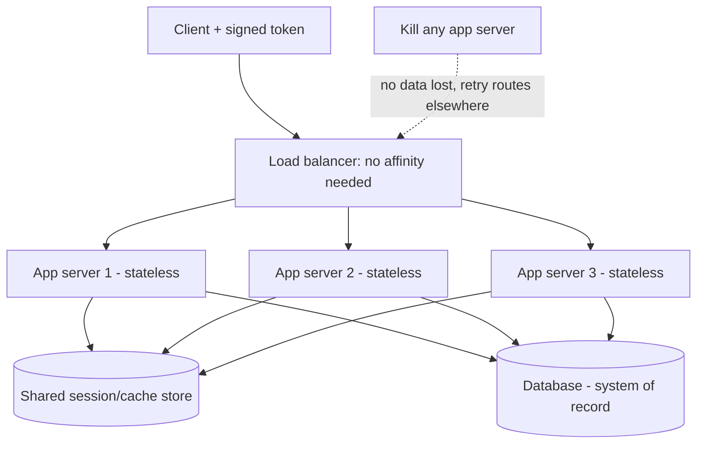

import WhenWhyTabs from '../../../components/WhenWhyTabs';

## Overview

A **stateless service** keeps no client-specific data in its own memory between
requests: everything it needs to handle a request arrives *in* the request (or
is fetched from a shared store), and nothing about the outcome is remembered
locally afterward. This single property is the precondition for almost all
horizontal scaling. If any server can handle any request from any user, you can
add servers behind a load balancer freely, remove them without warning, and
auto-scale on demand — because no request is tied to a specific machine's
memory. Statelessness is not a nice-to-have; it is the thing that makes the
X-axis of the scale cube (cloning) work at all.

State never disappears — it *moves*. The discipline of stateless design is
deciding *where* each piece of state lives so the request-handling tier can stay
disposable.

## Mental model

Treat your app servers as **cattle, not pets**: identical, numbered,
interchangeable, and individually disposable. You should be able to kill any app
server mid-traffic and lose nothing but the in-flight requests it was
holding — which a retry to another server recovers. For that to be true, the
server must hold **no truth** of its own.

So the mental exercise for any piece of data is: *"If this server vanished right
now, would anything be lost?"* If yes, that data is misplaced — it belongs in a
shared, durable, or client-held location instead. Stateless design is just the
systematic relocation of every "yes" answer out of the request-handling tier.
The tier becomes a pure function: `response = handle(request, shared_state)`.

## Types / Variants

State has to live somewhere. The art is matching each kind of state to the right
home.

**Where state goes — the three destinations:**

- **In the database (system of record).** Durable, authoritative, transactional
  truth: accounts, orders, ledgers, balances. Always lands here eventually. The
  cost is latency, so it is fronted by caches.
- **In a shared cache / data store (Redis, Memcached, a session store).**
  Fast-access mutable state shared across all app instances: sessions, rate-limit
  counters, short-lived computed values, distributed locks. Survives app
  restarts, reachable by every instance, one network hop away. This is where most
  "session state" should live.
- **On the client (token, cookie, `localStorage`).** State carried *by* the
  request itself: a signed JWT, a CSRF token, UI preferences. Zero server-side
  storage, perfectly horizontal, but limited in size and unrevocable until it
  expires (you can't reach into a client to delete a token early).

**Session management — three strategies (the central decision):**

- **Sticky sessions (session affinity).** The load balancer pins each user to one
  server (by cookie or IP hash) so that server's local session memory keeps
  working. *Pros:* trivial to bolt onto a stateful app; no shared store. *Cons:*
  breaks the cattle model — if that server dies, the user's session dies; load
  rebalances unevenly; auto-scaling and deploys disrupt users. A crutch for apps
  that aren't yet stateless, not a scaling strategy.
- **Shared session store.** Sessions live in Redis/Memcached/a database; every
  app server reads/writes the same store, so any server handles any user. *Pros:*
  truly stateless app tier, survives server loss, clean auto-scaling. *Cons:* a
  network hop per session access and a shared dependency to scale and keep
  available. The standard answer for server-side sessions at scale.
- **Token-based / client-side sessions (JWT et al.).** The session state is
  *encoded and signed* into a token the client sends each request; the server
  verifies the signature and trusts the contents — no server-side session lookup
  at all. *Pros:* zero session storage, infinitely horizontal, no shared
  dependency. *Cons:* tokens can't be revoked before expiry without
  reintroducing server state (a denylist), they bloat every request, and stale
  claims (role changes) persist until the token expires. Keep them short-lived
  and pair with refresh tokens.

**Shared-nothing architecture.** The structural pattern that makes all of the
above coherent: no node shares memory or disk with another; nodes coordinate
only through messages and shared *external* stores. Each node is independent, so
the system scales by adding nodes with no growing coordination cost between them.
Sharded databases, stateless app tiers, and partitioned caches are all
shared-nothing.

## When to use / When NOT

- **Make services stateless when:** you want to scale horizontally, auto-scale, do
  rolling/zero-downtime deploys, or tolerate server failure — i.e. essentially
  always for a request-handling tier. This is the default; deviate only with a
  reason.
- **Sticky sessions are acceptable when:** you're migrating a legacy stateful app
  and can't yet externalize session state; or affinity is a *performance*
  optimization (warm local cache) rather than a *correctness* requirement, so
  losing a server only costs a cache miss, not data.
- **Token (JWT) sessions when:** you need a stateless auth layer across many
  services, want to avoid a session-store round trip, and can live with
  delayed revocation (short TTL + refresh). Good for service-to-service and
  microservice auth.
- **Shared session store when:** you need server-side sessions you can revoke
  instantly and keep small per-request payloads — the safe default for
  user-facing web sessions.
- **Avoid statelessness only when:** the workload is *inherently* stateful and
  affinity is fundamental — long-lived WebSocket/gaming connections, streaming
  sessions, or in-memory compute that's too expensive to externalize per request.
  Even then, externalize the *durable* state and treat the in-memory part as a
  recoverable cache.

## Tradeoffs

| Session strategy | Server-side storage | Survives server loss | Instant revocation | Per-request cost | Scales horizontally |
| ---------------- | ------------------- | -------------------- | ------------------ | ---------------- | ------------------- |
| Sticky (local) | Yes (in server RAM) | No | N/A (local) | None | Poorly (affinity) |
| Shared store | Yes (Redis/DB) | Yes | Yes | One network hop | Yes |
| Token (JWT) | No | Yes (no state) | No (needs denylist) | Sign-verify + larger requests | Best |

The core tension: **sticky** is easiest to retrofit but least scalable;
**tokens** scale best but trade away revocation and grow request size;
**shared store** is the balanced middle — stateless tier with revocable,
compact sessions at the price of a dependency. Most production systems use a
shared store for web sessions and tokens for service-to-service auth.

**Idempotency for scale.** Statelessness makes retries safe to *route*; idempotency
makes them safe to *execute*. When any server can handle a retry and clients/load
balancers retry on timeout, the same operation may run more than once. An
idempotent operation (same input → same effect, no matter how many times it runs)
turns "at-least-once delivery" into "effectively once." Implement it with an
**idempotency key**: the client sends a unique key per logical operation; the
server records the key + result on first execution and, on any retry with the
same key, returns the stored result instead of re-doing the work. This is
non-negotiable for payments, order creation, and any write behind a retrying
client — exactly the high-stakes paths in fintech (a double-charged loan
disbursement or repayment is a real incident). It pairs with delivery semantics
in the **Event-Driven Architecture** cluster.

## Diagram

A stateless app tier: any request can hit any server because all state lives in
shared stores or in the token the client carries.

## Try it

Walk the tabs to see when each session strategy wins and why.

<WhenWhyTabs
  client:visible
  caption="Choosing a session strategy"
  tabs={[
    { label: 'Sticky sessions', content: 'WHEN: migrating a legacy stateful app you cannot yet refactor, or when affinity is a pure performance optimization (warm local cache) and losing a server costs only a cache miss. WHY NOT: it pins users to servers, so a server death or a deploy kills their session, load rebalances unevenly, and auto-scaling disrupts active users. It breaks the cattle-not-pets model — a crutch, not a scaling strategy.' },
    { label: 'Shared session store', content: 'WHEN: you need server-side sessions that any instance can serve and you can revoke instantly (logout, ban, role change). The safe default for user-facing web sessions. WHY: the app tier becomes truly stateless and survives server loss; sessions stay small and revocable. COST: a Redis/DB round trip per session access and a shared dependency you must keep available and scale (itself often replicated/sharded).' },
    { label: 'Token-based (JWT)', content: 'WHEN: stateless auth across many services, avoiding a session-store hop, tolerant of delayed revocation. Ideal for service-to-service and microservice auth. WHY: zero server-side session storage → infinitely horizontal, no shared dependency. WHY NOT: tokens cannot be revoked before expiry without reintroducing state (a denylist), they enlarge every request, and stale claims persist until expiry. Mitigate with short TTLs + refresh tokens.' },
    { label: 'Idempotency', content: 'ALWAYS for retryable writes: payments, order/loan creation, repayments, any write behind a retrying client or at-least-once queue. WHY: when any stateless server can handle a retry and clients retry on timeout, an operation may execute more than once. An idempotency key (unique per logical operation, stored with its result) makes a repeat return the original result instead of re-executing — turning at-least-once into effectively-once and preventing double-charges.' },
  ]}
/>

## Real-world examples

- **Twelve-Factor App (factor VI, "Processes")** codifies the rule: app processes
  must be stateless and share-nothing; any persistent state belongs in a backing
  service. This is the operational definition most cloud platforms assume.
- **AWS / Kubernetes auto-scaling** works precisely because instances are
  stateless cattle — the scheduler adds and kills pods/instances freely; affinity
  (sticky sessions) is treated as a legacy escape hatch.
- **Stripe's idempotency keys** are the canonical production example: every
  charge-creation request carries an `Idempotency-Key` header so network retries
  never double-charge a customer.
- **JWT-based auth** (Auth0, Okta, and most OAuth2/OIDC deployments) issues
  short-lived signed access tokens plus refresh tokens — stateless verification
  with bounded staleness.

## Further reading

- [The Twelve-Factor App — VI. Processes](https://12factor.net/processes) — the canonical statement of stateless, share-nothing processes.
- [Stripe API — Idempotent Requests](https://stripe.com/docs/api/idempotent_requests) — idempotency keys as a production pattern for safe retries.
- [JWT vs server-side sessions (Auth0)](https://auth0.com/blog/stateless-auth-for-stateful-minds-jwt-vs-server-side-sessions/) — the revocation and sizing tradeoffs in depth.
- Related: **Rate limiting & throttling** (shared counters as state) and **Scaling the data tier** in this cluster; delivery semantics in **Event-Driven Architecture**.
