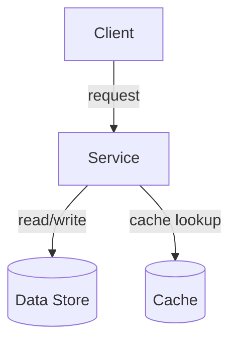

{/* TEMPLATE_VERSION: 1.0.0 */}
{/*
  CANONICAL TOPIC TEMPLATE (U1 / RT-4 — BINDING).
  Authors: copy this file into src/content/docs/<cluster>/<topic>.mdx and fill it in.
  KEEP THE SECTION ORDER FIXED — the nine "##" headings below must stay in this
  exact sequence so every topic reads consistently and CI drift-checks pass.
  If you change the section skeleton (add/remove/reorder headings), you MUST bump
  the TEMPLATE_VERSION marker on line 1, because a CI drift-check greps for it.
*/}
---
title: Topic Title (replace me)
description: One-sentence summary of this topic (replace me).
last_reviewed: 2026-01-01
decision_guidance: true
---

{/*
  Interactive widgets are added in a later task. When they exist, uncomment the
  imports below and drop the components into the "## Try it" section.

  import Mermaid from '../../components/Mermaid.astro';
  import DecisionTree from '../../components/DecisionTree';
  import CompareMatrix from '../../components/CompareMatrix';
  import WhenWhyTabs from '../../components/WhenWhyTabs';
  import TradeoffSlider from '../../components/TradeoffSlider';
*/}

## Overview

Briefly introduce the topic: what problem space it addresses and why a reader
should care. Two or three sentences.

## Mental model

Give the reader a single durable mental model or analogy for the concept.

## Types / Variants

Enumerate the major variants, flavors, or implementations and how they differ.

## When to use / When NOT

- **Use when:** ...
- **Avoid when:** ...

## Tradeoffs

Summarize the key tradeoffs (consistency, latency, cost, complexity, operational
burden). A table works well here.

| Option | Pros | Cons |
| ------ | ---- | ---- |
| A      | ...  | ...  |
| B      | ...  | ...  |

## Diagram

Use a Mermaid diagram to show the architecture or flow. Static-first: the raw
source is readable without JavaScript and hydrates to an SVG in the browser.

{/* Alternatively, once the import above is uncommented, use the component:
  <Mermaid code={`graph TD; Client-->Service; Service-->Store[(Data Store)];`} />
*/}

## Try it

Drop interactive widgets here once they exist (later task). Examples:

{/* <DecisionTree /> — guides the reader to a recommendation via Q&A */}
{/* <CompareMatrix /> — side-by-side comparison of variants */}
{/* <WhenWhyTabs /> — tabbed "when / why / why not" guidance */}
{/* <TradeoffSlider /> — interactive consistency-vs-availability style slider */}

## Real-world examples

Cite concrete systems or companies that apply this concept and how.

## Further reading

- [Link title](https://example.com) — short note on why it is worth reading.
