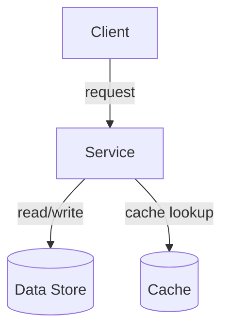

{/* TEMPLATE_VERSION: 1.0.0 */}
{/*
  CANONICAL TOPIC TEMPLATE (U1 / RT-4 — BINDING).
  Authors: copy this file into src/content/docs/<cluster>/<topic>.mdx and fill it in.

  Frontmatter MUST stay as the first thing in the file (the `---` block on line 1):
  Astro content collections require it there. This version marker and the author
  notes therefore sit BELOW the frontmatter — a verbatim copy of this file builds
  into a real page as-is. (Do not move the marker above the frontmatter; doing so
  makes Astro silently skip the page.)

  KEEP THE SECTION ORDER FIXED — the nine "##" headings below must stay in this
  exact sequence so every topic reads consistently and the CI drift-check passes.
  If you change the section skeleton (add/remove/reorder headings), you MUST bump
  the TEMPLATE_VERSION marker above, because the drift-check keys off it.

  Interactive widgets: uncomment the imports you need and drop the components into
  the "## Try it" section. Import path depth assumes a page at
  src/content/docs/<cluster>/<topic>.mdx (components are three levels up):

  import Mermaid from '../../../components/Mermaid.astro';
  import DecisionTree from '../../../components/DecisionTree';
  import CompareMatrix from '../../../components/CompareMatrix';
  import WhenWhyTabs from '../../../components/WhenWhyTabs';
  import TradeoffSlider from '../../../components/TradeoffSlider';
*/}

## Overview

Briefly introduce the topic: what problem space it addresses and why a reader
should care. Two or three sentences.

## Mental model

Give the reader a single durable mental model or analogy for the concept.

## Types / Variants

Enumerate the major variants, flavors, or implementations and how they differ.

## When to use / When NOT

- **Use when:** ...
- **Avoid when:** ...

## Tradeoffs

Summarize the key tradeoffs (consistency, latency, cost, complexity, operational
burden). A table works well here.

| Option | Pros | Cons |
| ------ | ---- | ---- |
| A      | ...  | ...  |
| B      | ...  | ...  |

## Diagram

Use a Mermaid diagram to show the architecture or flow. Static-first: the raw
source is readable without JavaScript and hydrates to an SVG in the browser.

{/* Once the Mermaid import above is uncommented you can also use the component:
  <Mermaid code={`graph TD; Client-->Service; Service-->Store[(Data Store)];`} />
*/}

## Try it

Drop interactive widgets here to make the guidance explorable. Examples:

{/* <DecisionTree client:visible root={{ question: '...', branches: [] }} /> */}
{/* <CompareMatrix client:visible columns={[]} rows={[]} cells={[]} /> */}
{/* <WhenWhyTabs client:visible tabs={[]} /> */}
{/* <TradeoffSlider client:visible stops={[]} /> */}

## Real-world examples

Cite concrete systems or companies that apply this concept and how.

## Further reading

- [Link title](https://example.com) — short note on why it is worth reading.
